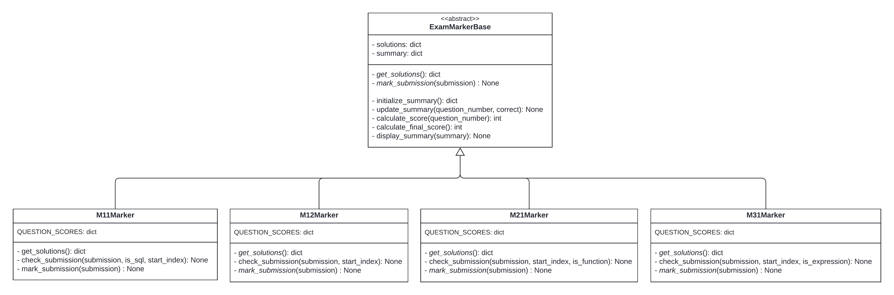
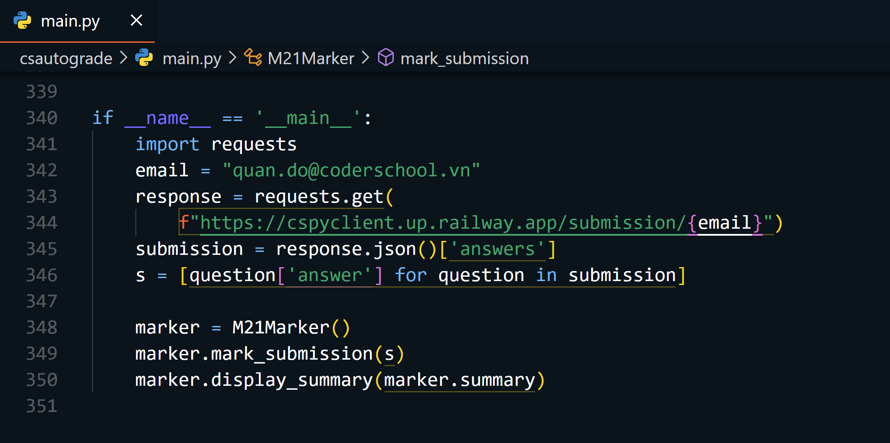

# T.i. - Test Inspector for Automated Exam Grading

**Update** (21 June 2024): Finished M2.1 and M3.1 exams.

## I. About the project

An automated grading system designed to accumulate the exam marking process. It leverages sophisticated software to ensure accurate and efficient assessment, saving valuable time for teaching assistants and enhancing the overall grading experience.

The system grades learner exams by performing the following steps:
1. Retrieve the learner's submission from the platform through exam client (cspyexamclient).
2. Grade learner submission via multiple types of checks and evaluations   
3. Generate report based on marking outcome

## II. Types of questions
### 1. Multiple choices
In multiple-choice questions, learners are typically required to choose one answer from four options. The system compares the student's submission with the correct solution and the submission will be marked **correct** if it matches the solution.
**Note**: Some multiple-choice questions may allow more than one correct answer. In such cases, the solutions dictionary will contain a list of valid answers. The system will check if the student's submission is included in this list. If the submission matches any of the valid answers, it will be marked as **correct**. Otherwise, it will be marked as **incorrect**.

### 2. Multiple corrects
Some questions require learners to select multiple correct answers from a collection of options. In these cases, the system compares the learner's submission with the set of correct answers.
- If the submission matches **exactly** with the correct set of answers, the response is marked as **correct**.
- If the submission includes **some but not all** of the correct answers, the response is marked as **partial**.
- If **none** of the submitted answers match the correct options, the response is marked as **incorrect**.

### 3. Expressions
For certain questions, students are required to submit either an SQL query or a Pandas expression that produces a specific result. The autograding system compares the result of the student's query or expression with the correct solution to determine if they are similar.
- **SQL Queries**: The system executes the student's SQL query against a predefined database and compares the resulting dataset with the solution. The system is built to handle **inconsistent table names**, meaning minor naming discrepancies (e.g., different table aliases) will not affect the grading if the query logic is correct.
- **Pandas Expressions**: Similarly, for Pandas-based questions, the system evaluates the student's expression on a given DataFrame and compares the result to the expected output. The system can manage **inconsistent DataFrame or column names** and focuses on the correctness of the data transformation, rather than strict name matching.

### 4. Functions
For questions requiring students to submit a Python function, the system processes the function as a string. The function is first executed in the local Python environment using exec() to define it. Once defined, the function is evaluated against multiple test cases to check its correctness.
- **Correct**: If the function passes **all** test cases, it will be marked as **correct**.
- **Partial**: If the function passes **more than half** of the test cases but not all, it will be marked as **partially correct**.
- **Incorrect**: If the function results in a **runtime error** or does not pass **any** of the test cases, it will be marked as **incorrect**.

## III. Architecture
### Main Module
The autograding system is structured around an abstract base class `ExamMarkerBase` and four specialized child classes: `M11Marker`, `M12Marker`, `M21Marker`, and `M31Marker`. Each child class implements specific logic for grading distinct exams (M1.1, M1.2, M2.1, and M3.1), including custom scoring, solutions, and marking rules. The base class provides common functionality for managing student submissions, updating summaries, and calculating scores. This design promotes code reuse while allowing for specific customizations based on the requirements of each exam.

### Utils Module
The `Utils` class plays an essential role in evaluating coding expressions .e.g SQL queries, Python functions, Pandas expressions. It provides helper functions like `check_sql()` for SQL validation and `check_expression()` or `check_function()` for validating code expressions and function outputs. These functions are integrated into the marking process, particularly for SQL- and function-based questions. For detailed documentation, please refer to the `utils.py` module in the codebase.

### External Dependencies
- **requests**: Used for fetching exam solutions from external sources (e.g., for M1.1).
- **sqlite3**: Utilized for SQL-based questions (M1.1) by connecting to an SQLite database.
- **pandas**: Leveraged by M3.1 to load and manipulate salary data for SQL-related questions.
- **json**: Used to handle JSON-based exam solutions and test cases (M21Marker).

### Execution Flow
1. **Initialization**: Each child class initializes its respective solutions, score structure, and any additional resources (e.g., SQLite connection or Pandas DataFrame).
2. **Submission Marking**: The `mark_submission()` method is invoked, which checks each answer in the student's submission.
3. **Score Calculation**: Based on the correctness of each answer, the system updates the summary and calculates a final score.
4. **Summary Display**: After grading, the `display_summary()` method presents the student's performance in a readable format, along with the final score.

