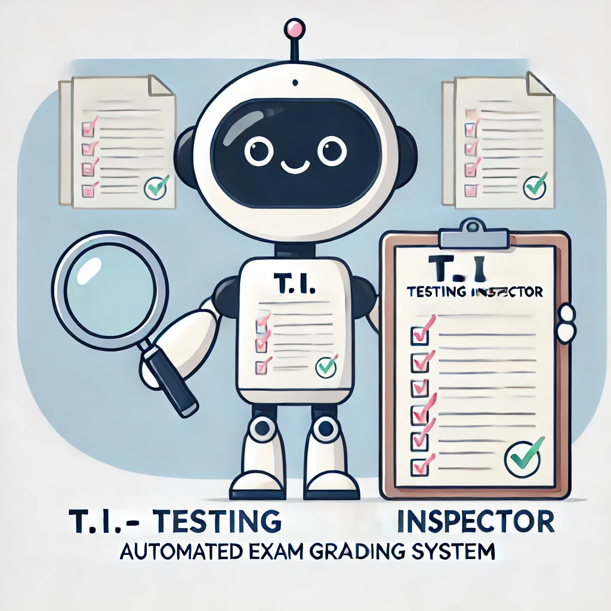

# T.i. - Test Inspector for Automated Exam Grading


**Update** (21 June 2024): Finished M2.1 and M3.1 exams. [Google Colab](https://colab.research.google.com/drive/1oaoiXxOZad97zGUsefFX9PAZ7kKg1G24?usp=sharing).

## About the project



T.i. is an automated grading system designed to streamline the exam marking process. It leverages sophisticated software to ensure accurate and efficient assessment, saving valuable time for teachning assistants and enhancing the overall grading experience.

The system grades learner exams by performing the following steps:

1. Retrieve the learner's submission from the platform using cspyclient.

2. Grade multiple choice questions:
   - For single-answer questions: Verify if the learner's submission matches the solution.
   - For multi-answer questions: Confirm if the learner's submission includes all correct answers as specified in the solution. If one of them does not match, mark as partial correct
   - For multi-correct questions (questions allowing more than one correct answer): Check if the learner's submission is a subset of the correct answers in the solution.

3. Grade coding questions 
   - Parse learner submission (string) into code. If cannot parse, mark as failed
   - Compare learner code's output with solution output    

4. Generate report based on marking outcome

## How to grade exam
1. Access the system via [Google Colab](https://colab.research.google.com/drive/1oaoiXxOZad97zGUsefFX9PAZ7kKg1G24?usp=sharing)
   - You will be asked to authorise access to your google drive, please just allow full access

2. Execute the first section to import necessary libraries and authorize the user

   

3. Select the module you wish to grade, enter the learner's email, and run the cell

4. After the marking process completes, run the subsequent cell to generate the grading report

   

## Note on using the system
**General Note**: If the marking is not as expected, please review the learner's submission by opening a new cell and printing their submission. Use the following commands:

```python
# 's' is combined from the learner's submission
print(s)

# Alternatively, print the summary to keep track of grading progress
print(summary)
```

### 1. Regarding M2.1 - Python Functions Submission
   - The system assumes that submissions will contain only Python functions. If a learner submits content other than Python functions, the system may be unable to parse it correctly, resulting in a failed grade.

### 2. 🚧Exams in Development - SQL Module:
   - There is an ongoing issue with extracting learner submissions. To resolve this, I am working on a solution that involves uploading learner submissions to temporary storage and extracting them via an API.
   - At the end of their exam, learners will be presented with a button to upload their submissions to the cloud.
   - The system will retrieve the latest submission using the learner's email instead of extracting it from the platform.

<div style="display: flex;">
  
  
</div>

## Coderschool projects 
- [x] T.e.o - The Excelent Organizer for Discord channel - [Github repo](https://github.com/nauqh/teo)
- [x]   T.i. - Test Inspector for Automated Exam Grading - [Github repo](https://github.com/nauqh/autograde) 
